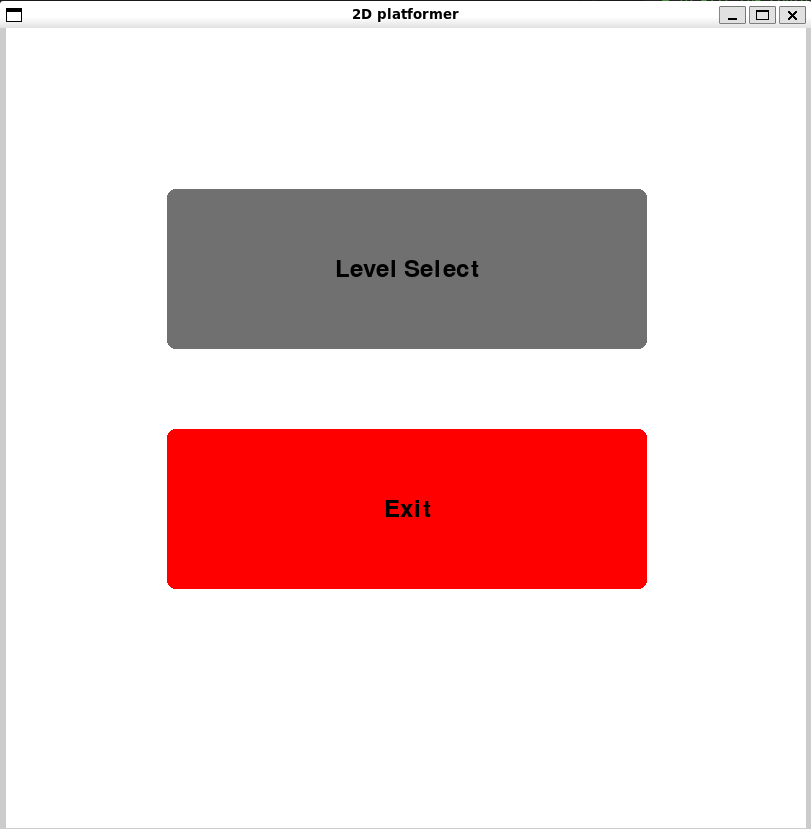
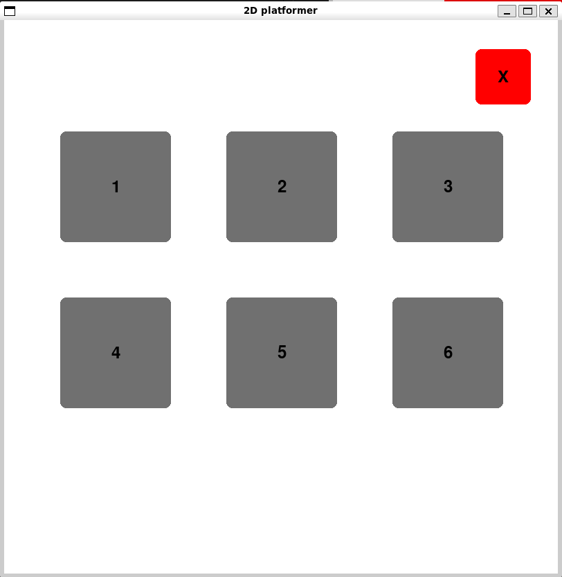
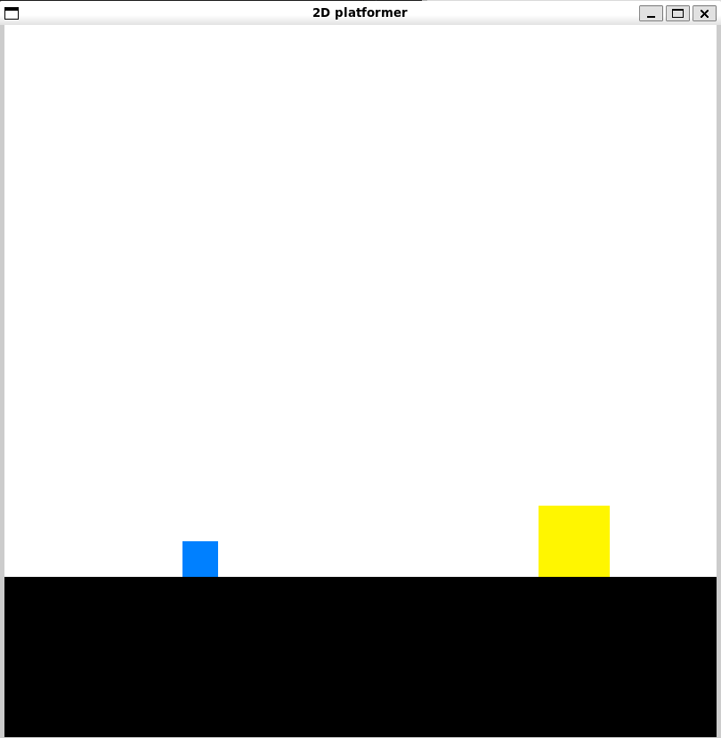

# OOP-Final_Project

| Team                | Ryan Gardner, Patrick Murphy                               |
| :------------------ | :--------------------------------------------------------- |
| **Course**          | CSCI375 - OOP & Design Patterns                            |
| **Section**         | 1                                                          |
| **Semester**        | Fall 2025                                                  |
| **Student**         | Ryan Gardner, Patrick Murphy                               |
| **Mav Username**    | Rcgardner, Pdmurphy2                                       |
| **GitHub Username** | Rygardner, Pdmurphy2                                       |
| **Repository**      | https://github.com/Rygardner/OOD-Final_Project             |
| **Project**         | Classic 2D Platformer                                      |
| **Grades**          | self grade is a 106/100, see [here](https://github.com/Rygardner/OOD-Final_Project/tree/main/showcase-grades%20folder) for more info            |

#
## Setting up to play

**Requirements:**   
- `pygame`
- `python 3.12+`
# 
### Running the game
If you have pygame installed, then you can simple run the `python command` or `make command` to play.

In the `Game` folder:
```bash
# Make command
make play

# Python command (assuming you're on 3.12)
python game.py

# Python 3 command
python3 game.py
```


From the project **root**:   
```bash
# Make command
make play

# Python command (assuming you're on 3.12)
python Game/game.py

# Python 3 command
python3 Game/game.py
```

## Running the Game with Docker

- edit .env files to change container names
```bash
# Example .env
CONTAINER_NAME=game-container
IMAGE_NAME=game-image
REPO_NAME=game-repo
```

You can run the following docker commands to build and run your container
```bash
# This will build your container and run it in the background
docker-compose up -d --build

# Run the container in background (if already built)
docker-compose up -d

# Check running containers
docker ps

# Enter container with zsh terminal
docker exec -it <container-name> zsh

# To exit the container
exit

# To stop the container after exiting
docker-compose down
```
-if you modify `Dockerfile` or `requirements.txt` file, you must rebuild the image

<br>

Inside the container you can then run make play from the project `root` or inside the `Game` folder. 
```bash
# Make command to play
make play
```
Or alternatively you can run the python commands
```bash
# From project root (assuming python 3.12)
python Game/game.py

# From game folder
python game.py
```

### Docker notes
This container cannot run pygame inside of GitHub codespaces because it does not have an X11/Wayland graphical environment

#
## Playing the game
Once you're in the game you'll be met with this screen:  



You can then press `Level Select` button to open up a new menu   

#
<br>



On this menu you can select one of our six levels to play. 
#

Once you click on a level, say level 1 for instance, you'll be in the game. **You are a `blue`** square and your goal is to touch the yellow square. Below is how it will look:



Controls
- Move left: `a`
- Move right: `d`
- Jump: `space`

You can also jump off a wall one time, reseting when you touch the ground.
#
### Good luck and have fun!
